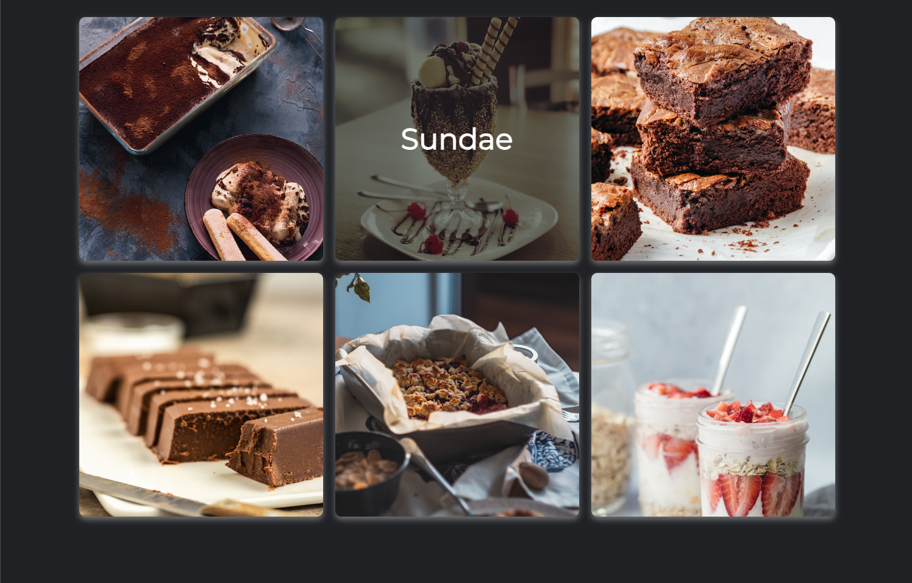
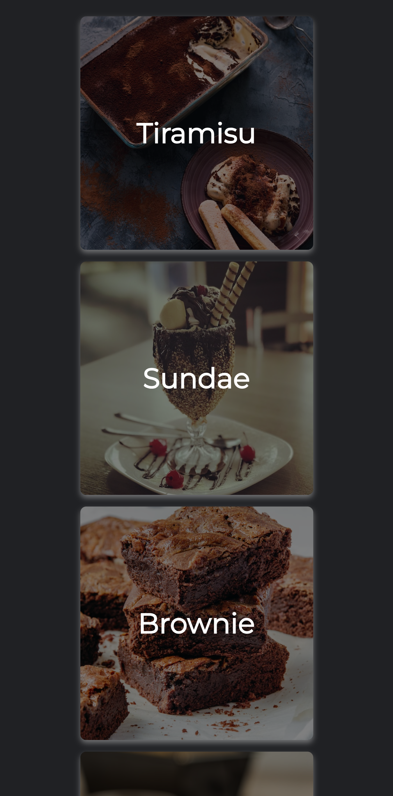

# HTML/CSS Challenge - Dessert Edition

## The End Goal

Recreate the following based on the minimal starting code in this repo.

### Desktop

### Mobile

## Some Useful Details

- The font is Montserrat and is publicly available [here](https://fonts.googleapis.com/css?family=Montserrat)
- Regardless of the width of the page, there should never be more than 3 cards in a row
- No need to have the exact pixel perfect dimensions, focus on the big picture
- In desktop mode, the text over images appears only on mouse over. In mobile, the text is always shown. 
